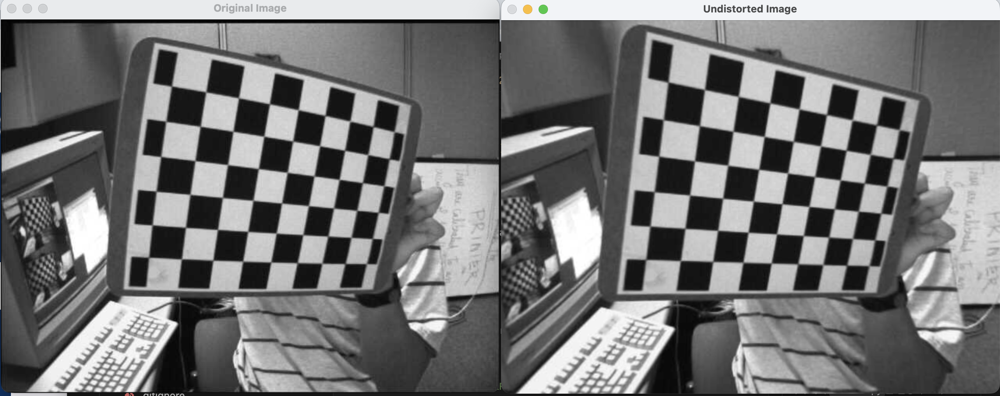
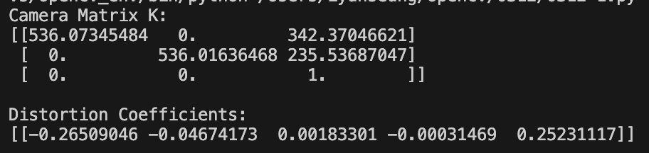
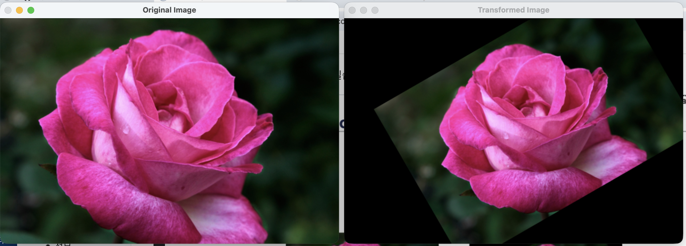
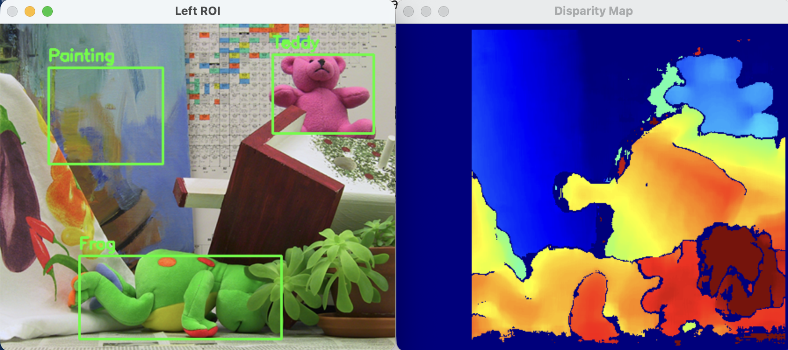
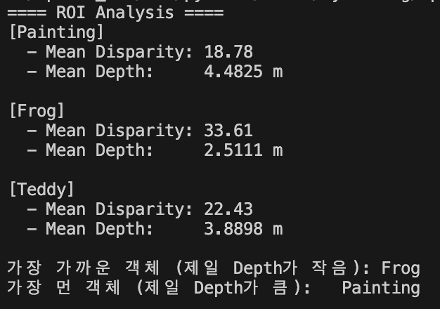

# OpenCV Image Formation 실습 과제 (0312)

---

##  과제 1: 체크보드 기반 카메라 캘리브레이션 (`0312-1.py`)

### 1. 문제 정의
*   여러 장의 체크보드 이미지에서 코너를 검출하고 실제 3D 좌표와의 대응 관계를 바탕으로 카메라 파라미터(내부 행렬, 왜곡 계수)를 추정합니다.
*   추정된 파라미터를 사용해 원본 이미지의 렌즈 왜곡을 보정하고 시각화합니다.

### 2. 전체 코드 (0312-1.py)
```python
import cv2
import numpy as np
import glob

# ---------------------------------------------------------
# [초기 설정] 체크보드 규격 및 알고리즘 정밀도 설정
# ---------------------------------------------------------
# 체크보드 내부 코너 개수 (검은색/흰색 사각형이 교차하는 점의 개수: 가로 9개, 세로 6개)
CHECKERBOARD = (9, 6)

# 체크보드 한 칸의 실제 물리적 크기 (25mm)
square_size = 25.0

# 찾아낸 코너의 좌표를 소수점 단위까지 더욱 정밀하게 다듬기 위한 조건 (Sub-pixel accuracy)
# 최대 30번 반복(MAX_ITER)하거나 오차가 0.001 이하(EPS)가 되면 탐색 종료
criteria = (cv2.TERM_CRITERIA_EPS + cv2.TERM_CRITERIA_MAX_ITER, 30, 0.001)

# 실제 세계(3차원 공간)에서의 체크보드 코너 좌표 생성 (Z축은 0으로 가정)
# 예: (0,0,0), (25,0,0), (50,0,0) ... 와 같이 25mm 간격의 격자 좌표를 미리 만들어둠
objp = np.zeros((CHECKERBOARD[0]*CHECKERBOARD[1], 3), np.float32)
objp[:, :2] = np.mgrid[0:CHECKERBOARD[0], 0:CHECKERBOARD[1]].T.reshape(-1, 2)
objp *= square_size

# 앞으로 처리할 여러 사진에서 찾은 좌표들을 차곡차곡 모아둘 빈 바구니(리스트) 두 개
objpoints = [] # 실제 3D 세계 좌표를 담을 리스트 (objp가 여러 개 들어감)
imgpoints = [] # 사진 상에서 찾은 2D 픽셀 좌표를 담을 리스트

# 보정용 이미지 파일들이 있는 폴더 경로 설정 (left01.jpg ~ left13.jpg 모두 찾기)
images = glob.glob("0312/images/calibration_images/left*.jpg")
img_size = None

# =========================================================
# 1. 체크보드 코너 검출 과정
# =========================================================
# 찾은 이미지 파일들을 하나씩 모두 꺼내서 반복 처리합니다.
for fname in images:
    img = cv2.imread(fname)                      # 컬러 이미지로 불러오기
    gray = cv2.cvtColor(img, cv2.COLOR_BGR2GRAY) # 코너 검출을 위해 흑백 이미지로 변환
    
    # 이미지의 가로/세로 픽셀 해상도 사이즈 기억해두기 (나중에 캘리브레이션 함수에 필요함)
    if img_size is None:
        img_size = gray.shape[::-1]

    # [핵심] 컴퓨터 비전 알고리즘으로 체스보드의 코너들을 1차적으로 쓱 훑어서 찾아냅니다.
    # 성공하면 ret은 True, corners에는 찾은 픽셀 좌표들이 담깁니다.
    ret, corners = cv2.findChessboardCorners(gray, CHECKERBOARD, None)

    # 코너를 성공적으로 9x6개 모두 찾았다면?
    if ret == True:
        # 실제 3D 좌표 세트(미리 만들어둔 objp)를 정답 바구니에 담습니다.
        objpoints.append(objp)
        
        # 1차적으로 찾은 픽셀 좌표(corners)를 아까 설정한 criteria 조건에 맞춰서
        # 소수점 단위까지 아주 정밀하게 위치를 한 번 더 깎고 다듬습니다. (정확도 상승)
        corners2 = cv2.cornerSubPix(gray, corners, (11, 11), (-1, -1), criteria)
        
        # 다듬어진 최종 2D 픽셀 좌표를 바구니에 담습니다.
        imgpoints.append(corners2)

cv2.destroyAllWindows()

# =========================================================
# 2. 카메라 캘리브레이션 (파라미터 추출)
# =========================================================
# 위에서 열심히 모은 정답 3D 좌표(objpoints)와 이미지 2D 좌표(imgpoints)를 바탕으로
# 이 카메라가 어떤 왜곡을 가졌고, 렌즈 초점거리가 어떤지(내부 행렬) 역산해냅니다!
ret, K, dist, rvecs, tvecs = cv2.calibrateCamera(objpoints, imgpoints, img_size, None, None)

# 계산된 결과 출력
print("Camera Matrix K (카메라 내부 행렬: 초점거리 및 센서 중심점 정보):")
print(K)

print("\nDistortion Coefficients (렌즈 왜곡 계수: 방사형 및 접선형 렌즈 찌그러짐 정도):")
print(dist)

# =========================================================
# 3. 실제 이미지 왜곡 보정 시각화
# =========================================================
# 계산된 수치가 정말 맞는지 확인해보기 위해, 첫 번째 사진(test_img)을 꺼냅니다.
test_img = cv2.imread(images[0])

# [핵심] 아까 구한 카메라 행렬(K)과 왜곡 계수(dist)를 이용해 둥글게 휘어진 사진을 평평하게 폅니다.
undistorted_img = cv2.undistort(test_img, K, dist, None, K)

# 렌즈 왜곡이 펴지기 전/후 사진을 나란히 화면에 띄워 눈으로 비교합니다.
cv2.imshow('Original Image (Before)', test_img)
cv2.imshow('Undistorted Image (After)', undistorted_img)

print("\n보정 결과 시각화 중... 아무 키나 누르면 종료됩니다.")
cv2.waitKey(0)
cv2.destroyAllWindows()
```

### 3. 요구사항 별 핵심 코드 설명
*   **체크보드 검출 및 대응 좌표 구성:**
    ```python
    ret, corners = cv2.findChessboardCorners(gray, CHECKERBOARD, None)
    if ret == True:
        objpoints.append(objp)
        corners2 = cv2.cornerSubPix(gray, corners, (11, 11), (-1, -1), criteria)
        imgpoints.append(corners2)
    ```
    > `findChessboardCorners`를 이용해 이미지 내 2D 코너를 찾습니다. 성공한 이미지에 대해서만 미리 25mm 간격으로 정의해둔 실제 3D 좌표(`objp`)와 매핑시킵니다.
*   **파라미터 추정 및 왜곡 보정:**
    ```python
    ret, K, dist, rvecs, tvecs = cv2.calibrateCamera(objpoints, imgpoints, img_size, None, None)
    undistorted_img = cv2.undistort(test_img, K, dist, None, K)
    ```
    > 추출한 좌표를 `calibrateCamera`에 넣고 돌리면 카메라 행렬(`K`) 및 왜곡 계수(`dist`)를 얻을 수 있습니다. 얻은 파라미터를 `undistort`에 전달해 렌즈 왜곡에 의해 휘어진 부분을 반듯하게 폅니다.

### 4. 결과 사진(매트릭스, 왜곡계수)
<!-- 여기에 캘리브레이션 결과 콘솔 메시지 캡처 및 전/후 이미지 캡처 삽입 -->



---

##  과제 2: 이미지 Rotation & Transformation (`0312-2.py`)

### 1. 문제 정의
*   단일 이미지에 기하학적 변환(회전, 스케일링, 평행이동)을 동시에 적용합니다.
*   요구사항: 현재 위치 기준 **+30도 회전**, 크기 **0.8배 축소**, x축 **+80px**, y축 **-40px** 이동.

### 2. 전체 코드 (0312-2.py)
```python
import cv2
import numpy as np
import os
from pathlib import Path

# =========================================================
# 1. 테스트 이미지 로드 및 경로 설정
# =========================================================
# Python 코드 파일이 있는 현재 위치를 기준으로 절대 경로를 설정합니다. 
# (에러 없이 안전하게 이미지를 불러오기 위함)
base_dir = Path(__file__).parent
img_path = str(base_dir / "images" / "rose.png")

# 만약 rose.png 파일을 찾을 수 없다면 첫번째 과제의 체크보드 이미지를 대신 사용합니다.
if not os.path.exists(img_path):
    print(f"Error: {img_path} not found! Using left01.jpg instead.")
    img_path = str(base_dir / "images" / "calibration_images" / "left01.jpg")

# 이미지를 불러오고 이미지의 높이(h)와 너비(w) 정보를 가져옵니다.
img = cv2.imread(img_path)
h, w = img.shape[:2]

# =========================================================
# 2. 이미지 변환(회전, 스케일)을 위한 기하학 중심 설정
# =========================================================
# 이미지를 팽이 돌리듯 회전시킬 때 '어디를 기준으로 돌릴 것인가'를 정합니다. 
# (여기서는 정중앙)
center = (w / 2, h / 2)

# 과제 요구사항 세팅
angle = 30  # 반시계 방향으로 30도 돌리기 (+30)
scale = 0.8 # 전체 이미지 크기를 80% 사이즈로 줄이기 (0.8배)

# [핵심] 기준점, 각도, 축소 비율을 던져주면, 해당 변환을 수학적으로 수행해 줄 
# 2x3 크기의 아핀 변환 행렬(M)을 OpenCV가 계산해서 만들어줍니다.
M = cv2.getRotationMatrix2D(center, angle, scale)

# =========================================================
# 3. 평행 이동(Translation) 덧붙이기
# =========================================================
# 아핀 변환 행렬(M)의 맨 오른쪽 '끝 열'은 이미지를 '좌우/상하로 얼마나 밀어낼 건지'를 결정합니다.
# M = [[cos, -sin, X축 이동량(tx)],
#      [sin,  cos, Y축 이동량(ty)]]

# 요구사항: x축으로 +80px(오른쪽), y축으로 -40px(위쪽) 이동
M[0, 2] += 80  # X축 이동량 덮어쓰기
M[1, 2] -= 40  # Y축 이동량 덮어쓰기

# =========================================================
# 4. 이미지 변환 적용 (Warp Affine)
# =========================================================
# 완성된 변환 행렬(M)을 주물럭거릴 원본 사진(img)에 덮어씌워버립니다. 
# cv2.warpAffine은 넘겨진 행렬대로 픽셀들을 새로운 위치에 쫙 이동시켜 줍니다.
transformed_img = cv2.warpAffine(img, M, (w, h))

# =========================================================
# 5. 결과 화면 출력
# =========================================================
# 이미지가 너무 클 수 있으므로 화면에 띄울 땐 0.5배(절반)로 임시 축소해서 띄웁니다.
scale_preview = 0.5
img_preview = cv2.resize(img, (int(w * scale_preview), int(h * scale_preview)))
transformed_preview = cv2.resize(transformed_img, (int(w * scale_preview), int(h * scale_preview)))

# 원본 이미지 창 하나, 회전+축소+이동된 이미지 창 하나 각각 띄우기
cv2.imshow('Original Image (Before)', img_preview)
cv2.imshow('Transformed Image (After)', transformed_preview)

print("Rotation & Transformation 결과 시각화 중... 아무 키나 누르면 종료됩니다.")
cv2.waitKey(0)              # 사용자가 키보드를 누를 때까지 창을 닫지 않고 무한 대기
cv2.destroyAllWindows()     # 키보드가 눌리면 모든 이미지 창 끄기
```

### 3. 요구사항 별 핵심 코드 설명
*   **회전 및 스케일 행렬 생성:**
    ```python
    M = cv2.getRotationMatrix2D(center, angle, scale)
    ```
    > 주어진 함수를 이용해 설정한 중심점 기반 `30`도 회전 및 `0.8` 크기로 변환 행렬 M을 생성합니다.
*   **평행이동 수동 편입 후 적용:**
    ```python
    M[0, 2] += 80
    M[1, 2] -= 40
    transformed_img = cv2.warpAffine(img, M, (w, h))
    ```
    > `getRotationMatrix2D`로 만든 $2 \times 3$ 행렬의 세 번째 열(인덱스 2)은 $X, Y$ 축 이동을 관장합니다. 여기에 각각 요구사항대로 $80, -40$을 더해준 후, `warpAffine`으로 이미지에 반영합니다.

### 4. 결과 사진


---

##  과제 3: Stereo Disparity 기반 Depth 추정 (`0312-3.py`)

### 1. 문제 정의
*   같은 장면을 바라보는 Left / Right 이미지 쌍을 이용해, 양안 시차(Disparity)를 계산합니다.
*   이를 바탕으로 피사체의 Depth를 환산하고, 지정된 개별 검출 객체(ROI) 중 제일 가까운 물체와 먼 물체를 판별합니다.

### 2. 전체 코드 (0312-3.py)
```python
import cv2
import numpy as np
from pathlib import Path

# =========================================================
# [초기 설정] 경로, 파라미터 및 관심 영역(ROI) 지정
# =========================================================
# 이 스크립트(.py)가 위치한 폴더를 기준으로 상대 경로의 꼬임을 막기 위해 절대경로(`base_dir`)를 잡습니다.
base_dir = Path(__file__).parent
output_dir = base_dir / "outputs"
output_dir.mkdir(parents=True, exist_ok=True) # outputs 폴더가 없으면 새로 만듭니다.

# 좌/우 시점의 카메라가 찍은 스테레오 이미지를 흑백으로 불러옵니다. (Depth 연산은 흑백 픽셀 값 차이로 계산)
left_color = cv2.imread(str(base_dir / "images" / "left.png"))
right_color = cv2.imread(str(base_dir / "images" / "right.png"))

if left_color is None or right_color is None:
    raise FileNotFoundError("좌/우 이미지를 찾지 못했습니다. 경로를 확인해주세요.")

# 컬러 화면위에 글씨나 네모 박스를 치기 위해 원본을 복사해둡니다.
left_gray = cv2.cvtColor(left_color, cv2.COLOR_BGR2GRAY)
right_gray = cv2.cvtColor(right_color, cv2.COLOR_BGR2GRAY)

# 카메마 내장 스펙 정보 (focal length: 초점거리, B: 양 카메라 렌즈 간의 거리)
f = 700.0
B = 0.12

# 내가 거리(Depth)를 측정하고 싶은 특정 물체들의 위치 좌표(x, y, 가로길이, 세로길이) 미리 정의해두기
rois = {
    "Painting": (55, 50, 130, 110),
    "Frog": (90, 265, 230, 95),
    "Teddy": (310, 35, 115, 90)
}

# =========================================================
# 1. 시차(Disparity) 맵 계산
# =========================================================
# OpenCV에 내장된 스테레오 매칭 알고리즘 세팅 (블록 사이즈 15x15 구역 단위로 비교)
stereo = cv2.StereoBM_create(numDisparities=16*5, blockSize=15)

# 좌/우 흑백 이미지를 넣어서, 각 픽셀별로 화면 상 거리가 얼마나 차이나는지 (Disparity) 찾기
# (단, StereoBM은 기본적으로 결과값을 소수점 없이 표현하기 위해 16배 뻥튀기(16 Scale)해서 반환해줍니다)
disparity_16S = stereo.compute(left_gray, right_gray)

# 실제 정확한 픽셀 단위 시차값을 구하려면, float(소수)로 바꾸고 16.0으로 다시 나눠줘야 합니다.
disparity = disparity_16S.astype(np.float32) / 16.0


# =========================================================
# 2. 실제 깊이(Depth) 맵 변환  (공식: Z = fB / d)
# =========================================================
# 시차(disparity)가 0 이하라면 카메라가 매칭점을 찾지 못했다는 뜻이므로 거리를 구하지 않습니다.
valid_mask = disparity > 0

# 깊이값을 저장할 빈 공간(도화지) 준비
depth_map = np.zeros_like(disparity, dtype=np.float32)

# 유효한(>0) 픽셀들에 한해서만 "초점거리 * 베이스라인 / 시차" 공식을 적용하여 실제 미터(m) 단위 깊이를 도출해냅니다!
depth_map[valid_mask] = (f * B) / disparity[valid_mask]


# =========================================================
# 3. 각 물체(ROI) 별 평균 시차(Disparity) 및 깊이(Depth) 분석
# =========================================================
results = {}

for name, (x, y, w, h) in rois.items():
    # 앞서 구한 전체 지도(map)에서 그 물체에 해당하는 네모 영역만 칼로 잘라옵니다. (슬라이싱)
    roi_disp = disparity[y:y+h, x:x+w]
    roi_depth = depth_map[y:y+h, x:x+w]
    
    # 잘라온 영역 중에서 계산에 성공한 픽셀(값이 0보다 큼)들만 뽑아냅니다.
    valid_roi_mask = roi_disp > 0
    
    if np.any(valid_roi_mask):
        # 성공한 픽셀들의 평균값 도출
        mean_disp = np.mean(roi_disp[valid_roi_mask])
        mean_depth = np.mean(roi_depth[valid_roi_mask])
    else:
        # 실패했다면 깊이는 무한대(알 수 없음) 취급
        mean_disp = 0
        mean_depth = float('inf')
        
    # 물체 이름별로 결과를 딕셔너리에 갈무리 보관
    results[name] = {"disparity": mean_disp, "depth": mean_depth}


# =========================================================
# 4. 콘솔에 분석 결과 예쁘게 텍스트로 치기
# =========================================================
print("==== ROI Analysis (각 물체별 깊이 분석 결과) ====")
for name, res in results.items():
    print(f"[{name}]")
    print(f"  - 평균 시차(Disparity): {res['disparity']:.2f} 픽셀")
    print(f"  - 평균 깊이(Depth)    : {res['depth']:.4f} m\n")

# 깊이를 측정 성공한 물체들 사이에서 누가 카메라에 제일 가깝고 누가 제일 먼지 정렬해서 비교해봅니다.
filtered_results = {k: v for k, v in results.items() if v['depth'] != float('inf')}
if filtered_results:
    # min은 값이 가장 작은 것(=제일 가까운 것), max는 값이 가장 큰 것(=제일 멀리 있는 것)
    closest_roi = min(filtered_results, key=lambda k: filtered_results[k]['depth'])
    farthest_roi = max(filtered_results, key=lambda k: filtered_results[k]['depth'])
    print(f"🎯 가장 가까운 객체 (Depth 값이 최저치임): {closest_roi}")
    print(f"🔭 가장 먼 객체 (Depth 값이 최고치임):   {farthest_roi}")


# =========================================================
# [부록] 5~8번. 결과 이미지를 그라데이션 컬러로 시각화 (눈으로 편하게 보기 위함)
# =========================================================
# 5. 시차(Disparity) 이미지 색깔 먹이기 (가까울수록 빨강, 멀수록 파랑)
disp_tmp = disparity.copy()
disp_tmp[disp_tmp <= 0] = np.nan
d_min, d_max = np.nanpercentile(disp_tmp, 5), np.nanpercentile(disp_tmp, 95)
if d_max <= d_min: d_max = d_min + 1e-6
disp_scaled = np.clip((disp_tmp - d_min) / (d_max - d_min), 0, 1)

disp_vis = np.zeros_like(disparity, dtype=np.uint8)
valid_disp = ~np.isnan(disp_tmp)
disp_vis[valid_disp] = (disp_scaled[valid_disp] * 255).astype(np.uint8)
# 일반 흑백이 아닌 푸른색부터 붉은색까지 예쁘게 퍼지는 컬러맵 입히기 (JET 옵션)
disparity_color = cv2.applyColorMap(disp_vis, cv2.COLORMAP_JET)

# 6. 깊이(Depth) 이미지 색깔 먹이기 (가까울수록 빨강, 멀수록 파랑이 되도록 값 반전시킴)
depth_vis = np.zeros_like(depth_map, dtype=np.uint8)
if np.any(valid_mask):
    depth_valid = depth_map[valid_mask]
    z_min, z_max = np.percentile(depth_valid, 5), np.percentile(depth_valid, 95)
    if z_max <= z_min: z_max = z_min + 1e-6
    depth_scaled = np.clip((depth_map - z_min) / (z_max - z_min), 0, 1)
    # 시차와 다르게 거리는 클수록 먼 것이므로 1.0에서 빼서 색 배합을 뒤집어줍니다.
    depth_scaled = 1.0 - depth_scaled
    depth_vis[valid_mask] = (depth_scaled[valid_mask] * 255).astype(np.uint8)

depth_color = cv2.applyColorMap(depth_vis, cv2.COLORMAP_JET)

# 7. 원본 좌측/우측 이미지에 관심구역(ROI) 네모 상자와 이름 치기
left_vis = left_color.copy()
for name, (x, y, w, h) in rois.items():
    # 초록색(0,255,0) 네모 박스 그리기
    cv2.rectangle(left_vis, (x, y), (x + w, y + h), (0, 255, 0), 2)
    # 그 네모 위쪽에 이름(텍스트) 띄우기
    cv2.putText(left_vis, name, (x, y - 8), cv2.FONT_HERSHEY_SIMPLEX, 0.6, (0, 255, 0), 2)

# 8. 만들어낸 그림들을 파일 폴더로 저장
cv2.imwrite(str(output_dir / "disparity_map.png"), disparity_color)
cv2.imwrite(str(output_dir / "depth_map.png"), depth_color)
cv2.imwrite(str(output_dir / "left_roi.png"), left_vis)

# 9. 화면에 결과물 팝업 창 띄우기 (만약 너무 크면 scale_preview를 조절하세요)
scale_preview = 1.0
h_disp, w_disp = disparity_color.shape[:2]
disp_preview = cv2.resize(disparity_color, (int(w_disp*scale_preview), int(h_disp*scale_preview)))
depth_preview = cv2.resize(depth_color, (int(w_disp*scale_preview), int(h_disp*scale_preview)))
color_preview = cv2.resize(left_vis, (int(w_disp*scale_preview), int(h_disp*scale_preview)))

cv2.imshow('Left Original (ROI)', color_preview)
cv2.imshow('Calculated Disparity Map', disp_preview)
cv2.imshow('Calculated Depth Map', depth_preview)

print("\n시각화된 이미지를 띄웠습니다. 아무 키나 누르면 코드 종료.")
cv2.waitKey(0)         # 키보드를 누를 때까지 창 가만히 냅두기
cv2.destroyAllWindows()# 키보드 눌리면 창 모두 없애기
```

### 3. 요구사항 별 핵심 코드 설명
*   **Disparity Map 계산 및 정규화:**
    ```python
    stereo = cv2.StereoBM_create(numDisparities=16*5, blockSize=15)
    disparity_16S = stereo.compute(left_gray, right_gray)
    disparity = disparity_16S.astype(np.float32) / 16.0
    ```
    > `StereoBM_create`를 사용하여 양안 시차를 픽셀 단위로 환산합니다. 이때 OpenCV의 BM 알고리즘 구현상 결과가 `16배 스케일된 short 정수형`으로 반환되므로, 연산의 정확도를 위해 `16.0` 실수형으로 나눠주어야 요구사항에 맞는 정확한 disparity 맵이 나타납니다.
*   **Depth Map 변환 및 ROI 판별:**
    ```python
    valid_mask = disparity > 0
    depth_map[valid_mask] = (f * B) / disparity[valid_mask]
    ```
    > disparity가 `0`보다 클 때(비매칭 오류 방지)만 $Z = \frac{fB}{d}$ 공식을 대입하여 뎁스를 구합니다. 이후 `rois` 딕셔너리의 좌표 박스를 슬라이싱 하여 해당 픽셀들의 평균을 추출해 가까운 순서를 비교합니다. 계산 결과, 가장 거리가 짧은(Depth가 작은) 물체는 개구리(Frog)임을 판별했습니다.

### 4. 결과 사진
<!-- 여기에 Depth 결과물 콘솔 메세지 및 Disparity Map, Depth Map 캡처 삽입 -->


