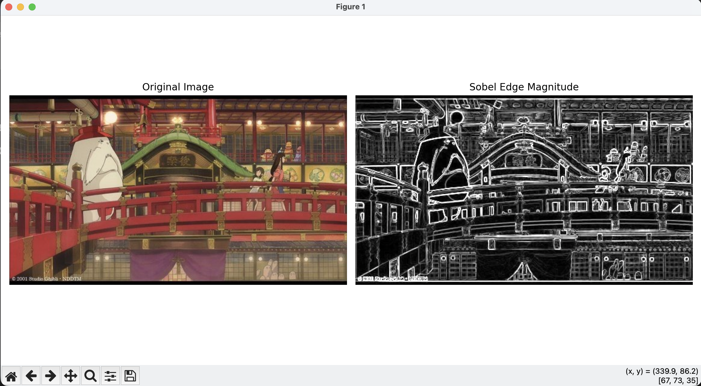
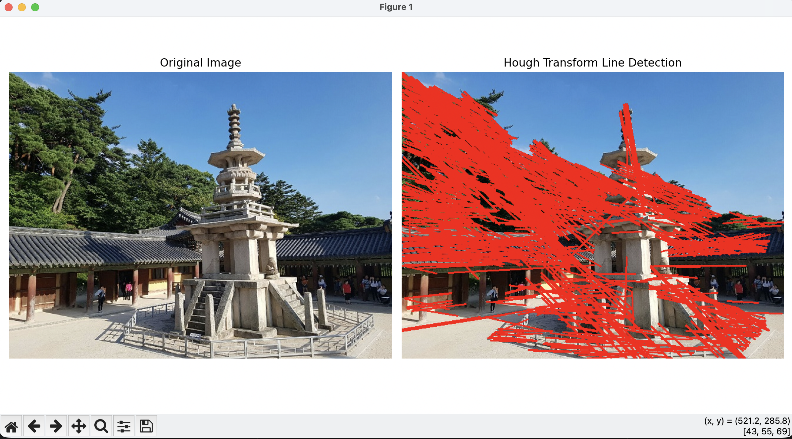
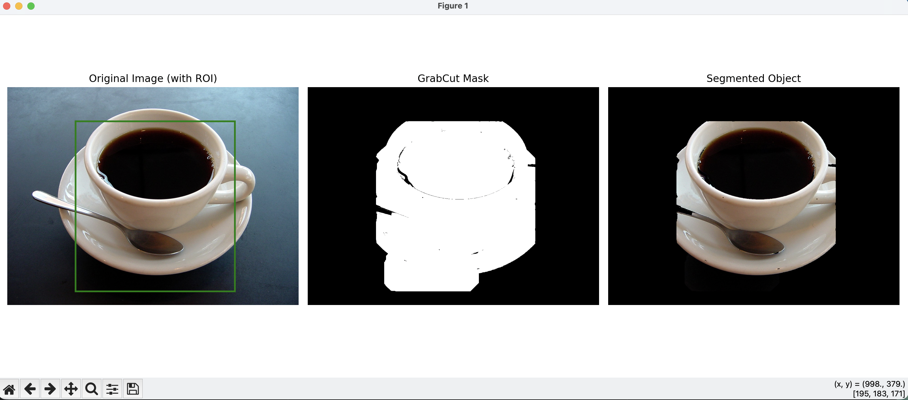

# OpenCV Edge and Region 실습 과제 (0319)

---

##  과제 1: 소벨 에지 검출 및 결과 시각화 (`0319-1.py`)

### 1. 문제 정의
*   `edgeDetectionImage.jpg` 이미지를 그레이스케일로 변환하고, Sobel 필터를 사용하여 x축과 y축 방향의 에지를 검출합니다.
*   구해진 에지 강도(Magnitude)를 이미지로 계산해 내고, 원본 이미지와 검출된 에지를 나란히 시각화하여 품질을 확인하는 것이 목표입니다.

### 2. 전체 코드 (0319-1.py)
```python
import cv2
import numpy as np
import matplotlib.pyplot as plt
from pathlib import Path

# =========================================================
# 1. 테스트 이미지 로드 및 경로 설정
# =========================================================
base_dir = Path(__file__).parent
img_path = str(base_dir / "edgeDetectionImage.jpg")
img = cv2.imread(img_path)

if img is None:
    print(f"Error: 이미지를 찾을 수 없습니다: {img_path}")
    exit()

# =========================================================
# 2. 그레이스케일 변환 및 에지 검출
# =========================================================
# 원본 이미지를 그레이스케일로 변환
gray = cv2.cvtColor(img, cv2.COLOR_BGR2GRAY)

# Sobel 필터를 사용하여 x축과 y축 방향의 에지 검출 (ksize=3)
sobel_x = cv2.Sobel(gray, cv2.CV_64F, 1, 0, ksize=3)
sobel_y = cv2.Sobel(gray, cv2.CV_64F, 0, 1, ksize=3)

# =========================================================
# 3. 에지 강도 계산
# =========================================================
# 검출된 x, y축 에지를 바탕으로 전체 에지 강도(Magnitude) 계산
magnitude = cv2.magnitude(sobel_x, sobel_y)

# 시각화를 위해 계산된 에지 강도 배열을 8비트 정수형(uint8)으로 변환
magnitude = cv2.convertScaleAbs(magnitude)

# =========================================================
# 4. 결과 시각화 (Matplotlib)
# =========================================================
plt.figure(figsize=(12, 6))

# 첫 번째 구획: 원본 이미지
plt.subplot(1, 2, 1)
plt.title('Original Image')
plt.imshow(cv2.cvtColor(img, cv2.COLOR_BGR2RGB))
plt.axis('off')

# 두 번째 구획: 에지 강도(Magnitude) 이미지
plt.subplot(1, 2, 2)
plt.title('Sobel Edge Magnitude')
plt.imshow(magnitude, cmap='gray')
plt.axis('off')

plt.tight_layout()
plt.show()
```

### 3. 요구사항 별 핵심 코드 설명
*   **Sobel 필터 에지 검출:**
    ```python
    sobel_x = cv2.Sobel(gray, cv2.CV_64F, 1, 0, ksize=3)
    sobel_y = cv2.Sobel(gray, cv2.CV_64F, 0, 1, ksize=3)
    ```
    > `cv2.Sobel`을 사용해 이미지 픽셀의 밝기 변화율인 그래디언트를 x축, y축 방향으로 검출하는 역할을 합니다. 이때, 미분 과정에서 발생할 수 있는 음수 값 잘림 등 정밀도 손실을 막기 위해 계산 스케일을 `cv2.CV_64F`(64bit float)로 크게 잡고 수행합니다.
*   **에지 강도 계산 및 시각화 준비:**
    ```python
    magnitude = cv2.magnitude(sobel_x, sobel_y)
    magnitude = cv2.convertScaleAbs(magnitude)
    ```
    > `cv2.magnitude`를 통해 X방향 벡터와 Y방향 벡터에 상관없이 두 값을 종합한 총체적인 절대 에지 강도를 하나로 도출합니다. 이후 `convertScaleAbs` 함수를 사용해 64비트 소수점 배열이었던 결과값을 우리가 화면 눈으로 볼 수 있는 `uint8`(0~255) 픽셀 포맷으로 절댓값 변환하는 역할을 수행합니다.

### 4. 결과 사진
<!-- 여기에 Sobel Edge 검출 결과 시각화 캡처 삽입 (Matplotlib Figure) -->


---

##  과제 2: 캐니 에지 및 허프 변환을 이용한 직선 검출 (`0319-2.py`)

### 1. 문제 정의
*   `dabo.jpg` 이미지에 강력한 캐니(Canny) 에지 검출 알고리즘을 수행하여 노이즈가 없는 정밀한 에지 맵을 생성합니다.
*   생성된 에지 맵을 기반으로 한 확률적 허프 변환(Hough Transform)을 적용하여, 이미지 안에 길게 이어져있는 직선 성분만을 찾아내고 원본 이미지 위에 이를 빨간색(Red) 선으로 그립니다.

### 2. 전체 코드 (0319-2.py)
```python
import cv2
import numpy as np
import matplotlib.pyplot as plt
from pathlib import Path

# =========================================================
# 1. 이미지 로드 및 경로 설정
# =========================================================
base_dir = Path(__file__).parent
img_path = str(base_dir / "dabo.jpg")
img = cv2.imread(img_path)

if img is None:
    print(f"Error: 이미지를 찾을 수 없습니다: {img_path}")
    exit()

# 시각화를 위해 원본의 RGB 사본 생성
img_rgb = cv2.cvtColor(img, cv2.COLOR_BGR2RGB)
img_result = img_rgb.copy()

# =========================================================
# 2. Canny 에지 맵 생성
# =========================================================
gray = cv2.cvtColor(img, cv2.COLOR_BGR2GRAY)

# Canny 함수를 사용해 에지 맵 생성 (threshold1=100, threshold2=200)
edges = cv2.Canny(gray, threshold1=100, threshold2=200)

# =========================================================
# 3. 허프 변환(Hough Transform)을 이용한 직선 검출
# =========================================================
# 거리(rho), 각도(theta), 직선으로 판단할 임계값(threshold)과
# 최소 선 길이(minLineLength), 선 사이의 최대 허용 간격(maxLineGap) 설정
lines = cv2.HoughLinesP(edges, rho=1, theta=np.pi/180, threshold=80, minLineLength=50, maxLineGap=10)

# =========================================================
# 4. 검출된 직선 그리기
# =========================================================
if lines is not None:
    for line in lines:
        x1, y1, x2, y2 = line[0]
        # 원본 이미지(RGB 사본) 위에 빨간색(255, 0, 0), 두께 2로 선 그리기
        cv2.line(img_result, (x1, y1), (x2, y2), (255, 0, 0), 2)

# =========================================================
# 5. 결과 시각화 (Matplotlib)
# =========================================================
plt.figure(figsize=(12, 6))

# 첫 번째 구획: 원본 이미지
plt.subplot(1, 2, 1)
plt.title('Original Image')
plt.imshow(img_rgb)
plt.axis('off')

# 두 번째 구획: 직선이 검출된 결과 이미지
plt.subplot(1, 2, 2)
plt.title('Hough Transform Line Detection')
plt.imshow(img_result)
plt.axis('off')

plt.tight_layout()
plt.show()
```

### 3. 요구사항 별 핵심 코드 설명
*   **Canny 에지 검출 적용:**
    ```python
    edges = cv2.Canny(gray, threshold1=100, threshold2=200)
    ```
    > 원본 흑백 이미지에 `cv2.Canny` 알고리즘을 적용해 잔상이나 노이즈가 제거된 깔끔한 1픽셀 두께의 확실한 엣지 선만을 뽑아내는 역할을 합니다. 이를 바탕으로 직선을 검출해야 오차가 없습니다.
*   **허프 변환 직선 검출:**
    ```python
    lines = cv2.HoughLinesP(edges, rho=1, theta=np.pi/180, threshold=80, minLineLength=50, maxLineGap=10)
    ```
    > 추출한 에지 결과인 `edges` 배열을 받아, 확률적 허프 변환(`cv2.HoughLinesP`)을 사용하여 실제 직선을 이루고 있는 픽셀의 시작점과 끝점 좌표 배열을 반환받는 역할을 합니다. 파라미터 조정을 통해 선의 길이가 최소 `50` 픽셀 이상이며, 선의 점들이 끊겨 있어도 그 틈이 `10` 픽셀 이하라면 하나의 이어져 있는 직선으로 부드럽게 인식하도록 정밀도로 제어했습니다.

### 4. 결과 사진
<!-- 여기에 Canny & Hough 직선 검출 결과 시각화 캡처 삽입 -->


---

##  과제 3: GrabCut을 이용한 대화식 영역 분할 및 객체 추출 (`0319-3.py`)

### 1. 문제 정의
*   `coffee cup.JPG` 이미지에 있는 중심 피사체(커피잔)를 배경에서 분리하여 추출하기 위해, 사용자가 대략적으로 지정한 사각형 영역을 초기 단서로 작동하는 GrabCut 알고리즘을 사용합니다.
*   객체 추출의 결과를 0과 1로 나뉜 흑백 마스크 형태로 뽑아 내고, 이를 활용해 원본에서 배경이 검게 제거되고 타겟 객체만 명확하게 남은 최종 이미지를 만드는 것이 목표입니다.

### 2. 전체 코드 (0319-3.py)
```python
import cv2
import numpy as np
import matplotlib.pyplot as plt
import matplotlib.patches as patches
from pathlib import Path

# =========================================================
# 1. 이미지 로드 및 초기 설정
# =========================================================
base_dir = Path(__file__).parent
img_path = str(base_dir / "coffee cup.JPG")
img = cv2.imread(img_path)

if img is None:
    print(f"Error: 이미지를 찾을 수 없습니다: {img_path}")
    exit()

img_rgb = cv2.cvtColor(img, cv2.COLOR_BGR2RGB)

# =========================================================
# 2. GrabCut 사각형 범위 및 배경/전경 모델 초기화
# =========================================================
# 커피잔이 위치한 영역을 대략적인 사각형(x, y, width, height)으로 지정
# (이미지 크기가 1280x960이므로 커피잔을 덮을 영역으로 세팅)
rect = (300, 150, 700, 750) 

# GrabCut 내부 계산을 위한 빈 배열 초기화 (1x65 크기의 float64 형식)
bgdModel = np.zeros((1, 65), np.float64)
fgdModel = np.zeros((1, 65), np.float64)

# 이미지와 동일한 크기의 0으로 채워진 마스크 생성
mask = np.zeros(img.shape[:2], np.uint8)

# =========================================================
# 3. GrabCut 알고리즘 실행
# =========================================================
# 지정한 사각형(rect)을 초기 영역으로 삼아 5번(iterCount) 반복 수행
cv2.grabCut(img, mask, rect, bgdModel, fgdModel, 5, cv2.GC_INIT_WITH_RECT)

# =========================================================
# 4. 마스크 처리 배경 제거
# =========================================================
# 확실한 배경(GC_BGD: 0)과 아마 배경(GC_PR_BGD: 2)인 곳은 0으로, 
# 확실한 전경(1)과 아마 전경(3)인 곳은 1로 변경
mask2 = np.where((mask == cv2.GC_BGD) | (mask == cv2.GC_PR_BGD), 0, 1).astype('uint8')

# 원본 이미지에 최종 마스크(0과 1)를 곱해 배경을 검게 지워냄
result = img * mask2[:, :, np.newaxis]
result_rgb = cv2.cvtColor(result, cv2.COLOR_BGR2RGB)

# =========================================================
# 5. 결과 시각화 (Matplotlib)
# =========================================================
plt.figure(figsize=(15, 6))

# 첫 번째 구획: 원본 이미지 (영역 표시 상자 포함)
plt.subplot(1, 3, 1)
plt.title('Original Image (with ROI)')
plt.imshow(img_rgb)
ax = plt.gca()
rect_patch = patches.Rectangle((rect[0], rect[1]), rect[2], rect[3], linewidth=2, edgecolor='g', facecolor='none')
ax.add_patch(rect_patch)
plt.axis('off')

# 두 번째 구획: 처리된 마스크 이미지
plt.subplot(1, 3, 2)
plt.title('GrabCut Mask')
# 마스크가 1인 곳(전경)을 하얗게 보이도록 시각화
plt.imshow(mask2 * 255, cmap='gray')
plt.axis('off')

# 세 번째 구획: 객체(전경) 추출 결과
plt.subplot(1, 3, 3)
plt.title('Segmented Object')
plt.imshow(result_rgb)
plt.axis('off')

plt.tight_layout()
plt.show()
```

### 3. 요구사항 별 핵심 코드 설명
*   **GrabCut 모델 초기화 및 1차 수행:**
    ```python
    bgdModel = np.zeros((1, 65), np.float64)
    fgdModel = np.zeros((1, 65), np.float64)
    cv2.grabCut(img, mask, rect, bgdModel, fgdModel, 5, cv2.GC_INIT_WITH_RECT)
    ```
    > `cv2.grabCut`의 내부적인 컬러 히스토그램 확률 계산 모델을 보관할 빈 배열(`bgdModel, fgdModel`)을 초기화해 집어넣습니다. 그리고 우리가 화면의 중심부로 지정해둔 `rect` 바운딩 박스를 초기 분할 지표(`GC_INIT_WITH_RECT`)로 삼아 알고리즘 분할 연산을 총 5번(iteration) 반복해서 수행하는 역할을 합니다.
*   **최종 마스크 변환 및 이미지상 배경 제거:**
    ```python
    mask2 = np.where((mask == cv2.GC_BGD) | (mask == cv2.GC_PR_BGD), 0, 1).astype('uint8')
    result = img * mask2[:, :, np.newaxis]
    ```
    > 방금 전 GrabCut 알고리즘이 예측하여 원본 마스크 행렬들에 채워 넣은 라벨 상태 번호를 일괄적으로 분류합니다. 배경(`GC_BGD`)이거나 아마도 배경(`GC_PR_BGD`)일 것이라고 표기된 좌표는 싹 `0`으로 날려버리고 나머지 객체는 모두 `1`로 치환합니다. 변환된 퓨어 마스크 행렬을 다시 원본 이미지(`RGB`) 다중 배열의 각 채널 컬러에 산술 곱해주어 결과적으로 배경이 검게 타버려 없어지는 역할을 수행합니다.

### 4. 결과 사진
<!-- 여기에 GrabCut 시각화 결과물 캡처 삽입 -->

