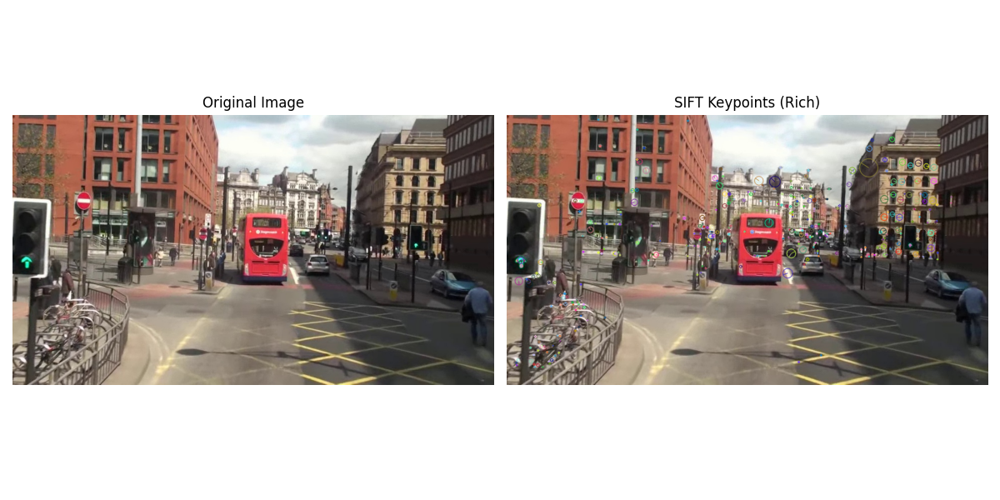
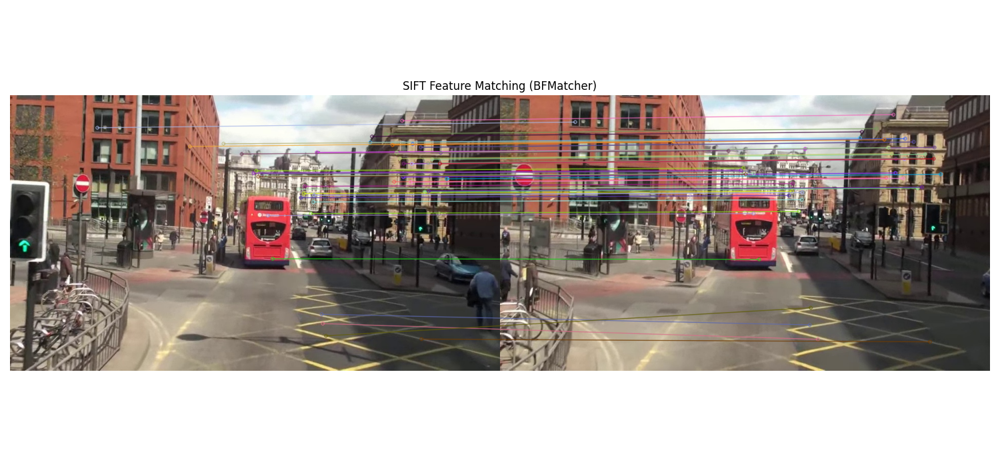
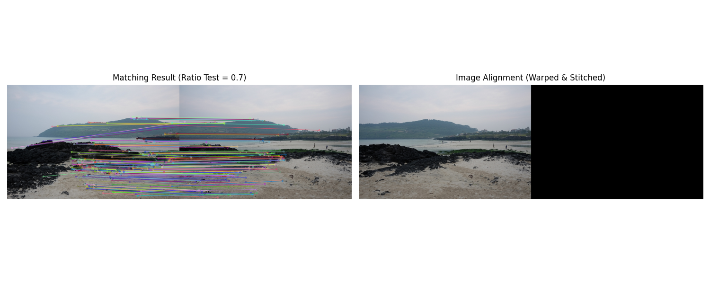
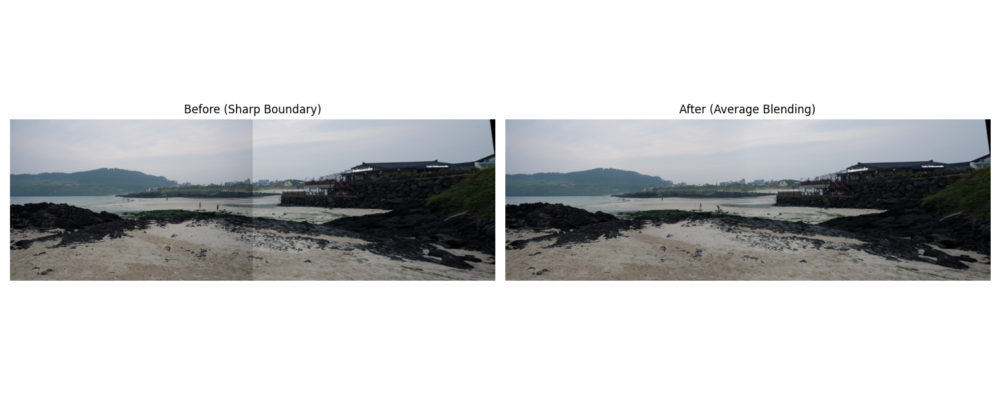

# OpenCV Local Feature 실습 과제 (0326)

---

##  과제 1: SIFT를 이용한 특징점 검출 및 시각화 (`0326-1.py`)

### 1. 문제 정의
*   `mot_color70.jpg` 이미지를 이용하여 SIFT(Scale-Invariant Feature Transform) 알고리즘을 사용해 특징점을 검출하고 이를 시각화합니다.
*   특징점이 너무 많이 나오는 것을 방지하기 위해 생성 개수를 제한하고, 검출된 위치의 방향과 크기를 시각적인 원형으로 함께 표시합니다.

### 2. 전체 코드 (0326-1.py)
```python
import cv2 as cv
import matplotlib.pyplot as plt
import os

# 현재 스크립트 파일 위치를 기준으로 이미지 경로 설정
base_dir = os.path.dirname(os.path.abspath(__file__))
img_path = os.path.join(base_dir, 'mot_color70.jpg')

# 이미지 읽기 (BGR 형식을 RGB로 변환하여 matplotlib에서 제대로 출력되도록 함)
img = cv.imread(img_path)
if img is None:
    print(f"이미지를 불러올 수 없습니다: {img_path}")
    exit(1)
img_rgb = cv.cvtColor(img, cv.COLOR_BGR2RGB)
img_gray = cv.cvtColor(img, cv.COLOR_BGR2GRAY)

# 요구사항: SIFT 객체 생성 (특징점이 너무 많지 않도록 nfeatures=500으로 제한)
sift = cv.SIFT_create(nfeatures=500)

# 요구사항: 특징점 검출 및 디스크립터 계산
keypoints, descriptors = sift.detectAndCompute(img_gray, None)

# 요구사항: 특징점 시각화 (크기와 방향 포함 옵션 설정)
img_keypoints = cv.drawKeypoints(
    img_rgb, 
    keypoints, 
    None, 
    flags=cv.DRAW_MATCHES_FLAGS_DRAW_RICH_KEYPOINTS
)

# 결과 출력 (원본 이미지와 특징점 시각화 이미지 나란히 배치)
plt.figure(figsize=(12, 6))

plt.subplot(1, 2, 1)
plt.imshow(img_rgb)
plt.title('Original Image')
plt.axis('off')

plt.subplot(1, 2, 2)
plt.imshow(img_keypoints)
plt.title('SIFT Keypoints (Rich)')
plt.axis('off')

plt.tight_layout()
plt.savefig(os.path.join(base_dir, '0326-1.png'))
# plt.show()
```

### 3. 요구사항 별 핵심 코드 설명
*   **SIFT 객체 생성 및 크기 제한:**
    ```python
    sift = cv.SIFT_create(nfeatures=500)
    keypoints, descriptors = sift.detectAndCompute(img_gray, None)
    ```
    > `cv.SIFT_create()`를 사용하여 영상의 크기(Scale)와 회전(Rotation)에 강인한 특징점 추출 객체를 선언합니다. `nfeatures` 값을 주어 가장 두드러진 500개의 주요 정보만 한정하여 뽑아냅니다.
*   **Rich Keypoints 시각화:**
    ```python
    img_keypoints = cv.drawKeypoints(img_rgb, keypoints, None, flags=cv.DRAW_MATCHES_FLAGS_DRAW_RICH_KEYPOINTS)
    ```
    > 추출된 `keypoints` 정보 안에는 픽셀 좌표뿐 아니라 해당 위치의 지배적인 에지 방향 표기 및 스케일(영역 크기) 정보가 함께 있습니다. `DRAW_RICH_KEYPOINTS` 옵션을 켜서 이러한 부가적인 메타 데이터들을 화면상에 동그라미와 선분 길이로 나타내게 해줍니다.

### 4. 결과 사진


---

##  과제 2: SIFT를 이용한 두 영상 간 특징점 매칭 (`0326-2.py`)

### 1. 문제 정의
*   두 개의 유사한 이미지(`mot_color70.jpg`, `mot_color83.jpg`)에서 SIFT 특징점을 각각 추출하고 서로 일치하는 지점을 찾아 매칭을 수행합니다.
*   매칭점간의 거리를 계산하여 가까운 매칭만을 선별해 선으로 연결하고, 두 이미지 사이의 대응을 시각적으로 확인합니다.

### 2. 전체 코드 (0326-2.py)
```python
import cv2 as cv
import matplotlib.pyplot as plt
import os

# 스크립트 파일 위치 기준 이미지 경로 설정
base_dir = os.path.dirname(os.path.abspath(__file__))
# mot_color80.jpg 라고 되어있으나 실제 제공된 파일명은 mot_color83.jpg 로 가정
img1_path = os.path.join(base_dir, 'mot_color70.jpg')
img2_path = os.path.join(base_dir, 'mot_color83.jpg')

# 요구사항: 1. cv.imread()를 사용하여 두 개의 이미지를 불러옴
img1 = cv.imread(img1_path)
img2 = cv.imread(img2_path)

if img1 is None or img2 is None:
    print("이미지를 불러올 수 없습니다. 경로를 확인해주세요.")
    exit(1)

# BGR -> RGB 및 BGR -> GRAY 변환
img1_rgb = cv.cvtColor(img1, cv.COLOR_BGR2RGB)
img2_rgb = cv.cvtColor(img2, cv.COLOR_BGR2RGB)
img1_gray = cv.cvtColor(img1, cv.COLOR_BGR2GRAY)
img2_gray = cv.cvtColor(img2, cv.COLOR_BGR2GRAY)

# 요구사항: 2. cv.SIFT_create()를 사용하여 특징점 추출
sift = cv.SIFT_create()
kp1, des1 = sift.detectAndCompute(img1_gray, None)
kp2, des2 = sift.detectAndCompute(img2_gray, None)

# 요구사항: 3. cv.BFMatcher()를 사용하여 두 영상 간 특징점 매칭
bf = cv.BFMatcher(cv.NORM_L2, crossCheck=True)
matches = bf.match(des1, des2)

# 거리에 따라 정렬하여 우수한 매칭점들을 선별
matches = sorted(matches, key=lambda x: x.distance)

# 요구사항: 4. cv.drawMatches()를 사용하여 매칭 결과 시각화
img_matches = cv.drawMatches(
    img1_rgb, kp1, 
    img2_rgb, kp2, 
    matches[:50], None, 
    flags=cv.DrawMatchesFlags_NOT_DRAW_SINGLE_POINTS
)

# 결과 출력
plt.figure(figsize=(15, 7))
plt.imshow(img_matches)
plt.title('SIFT Feature Matching (BFMatcher)')
plt.axis('off')

plt.tight_layout()
plt.savefig(os.path.join(base_dir, '0326-2.png'))
# plt.show()
```

### 3. 요구사항 별 핵심 코드 설명
*   **Brute-Force (BF) Matcher 적용:**
    ```python
    bf = cv.BFMatcher(cv.NORM_L2, crossCheck=True)
    matches = bf.match(des1, des2)
    ```
    > 추출한 각각의 디스크립터 행렬 간의 거리를 전수조사하여 가장 유사성 짙은 대응점들을 매칭합니다. SIFT 기술자는 연속적인 실수 벡터로 되어있으므로 거리 측정 방식으로 `cv.NORM_L2` (유클리디언 거리)를 기준 삼으며, `crossCheck=True` 옵션을 통해 영상 1에서 2로 찾았을 때와 역으로 2에서 1로 찾았을 때의 쌍이 상호 일치하는 경우에만 신뢰도를 높여 올바른 매칭으로 받아들입니다.

### 4. 결과 사진


---

##  과제 3: 호모그래피를 이용한 이미지 정합 (Image Alignment) (`0326-3.py`)

### 1. 문제 정의
*   `img2.jpg`와 `img3.jpg`의 SIFT 특징점을 활용해 매칭하고 일치하는 점들을 바탕으로 호모그래피(Homography) 변환 행렬을 추정합니다.
*   도출된 행렬을 이용해 `img3`을 대상의 시점으로 형태를 변환(Perspective Warp)시키고 서로 겹치게 하여 간단한 파노라마 형태의 정합(Alignment)을 달성합니다.

### 2. 전체 코드 (0326-3.py)
```python
import cv2 as cv
import numpy as np
import matplotlib.pyplot as plt
import os

base_dir = os.path.dirname(os.path.abspath(__file__))
# 요구사항: 샘플파일로 img2.jpg, img3.jpg 사용
img1_path = os.path.join(base_dir, 'img2.jpg')
img2_path = os.path.join(base_dir, 'img3.jpg')

img1 = cv.imread(img1_path)
img2 = cv.imread(img2_path)

if img1 is None or img2 is None:
    print("이미지를 불러올 수 없습니다.")
    exit(1)

img1_rgb = cv.cvtColor(img1, cv.COLOR_BGR2RGB)
img2_rgb = cv.cvtColor(img2, cv.COLOR_BGR2RGB)
img1_gray = cv.cvtColor(img1, cv.COLOR_BGR2GRAY)
img2_gray = cv.cvtColor(img2, cv.COLOR_BGR2GRAY)

# 2. SIFT 객체 생성 및 특징점 검출
sift = cv.SIFT_create()
kp1, des1 = sift.detectAndCompute(img1_gray, None)
kp2, des2 = sift.detectAndCompute(img2_gray, None)

# 3. BFMatcher 및 knnMatch 적용
bf = cv.BFMatcher(cv.NORM_L2)
matches = bf.knnMatch(des1, des2, k=2)

# 좋은 매칭점 선별 (Ratio Test)
good_matches = []
for m, n in matches:
    if m.distance < 0.7 * n.distance:
        good_matches.append(m)

if len(good_matches) < 4:
    print("충분한 매칭점이 없습니다 (최소 4개 필요).")
    exit(1)

# 매칭 결과 (Matching Result) 이미지 시각화
img_matches = cv.drawMatches(
    img1_rgb, kp1, 
    img2_rgb, kp2, 
    good_matches, None, 
    flags=cv.DrawMatchesFlags_NOT_DRAW_SINGLE_POINTS
)

# 4. 호모그래피 계산을 위한 좌표 추출
src_pts = np.float32([kp1[m.queryIdx].pt for m in good_matches]).reshape(-1, 1, 2)
dst_pts = np.float32([kp2[m.trainIdx].pt for m in good_matches]).reshape(-1, 1, 2)

# RANSAC을 사용하여 이상점 억제 및 호모그래피 도출
H, mask = cv.findHomography(src_pts, dst_pts, cv.RANSAC, 5.0)

# 5. 한 이미지를 변환하여 다른 이미지와 정렬 (Image Alignment)
h1, w1 = img1.shape[:2]
h2, w2 = img2.shape[:2]

# 출력 크기를 파노라마 캔버스 크기 (w1+w2, max(h1,h2))로 설정
result_w = w1 + w2
result_h = max(h1, h2)

# img1을 대상 평면으로 원근 투시 변환
warped_img = cv.warpPerspective(img1_rgb, H, (result_w, result_h))

# Warped image 공간 위에 img2의 내용을 덮어씌움 (img2가 기준점) 
warped_img[0:h2, 0:w2] = img2_rgb

# 6. 결과 시각화 (Matching Result & Warped Image)
plt.figure(figsize=(15, 6))

plt.subplot(1, 2, 1)
plt.imshow(img_matches)
plt.title('Matching Result (Ratio Test = 0.7)')
plt.axis('off')

plt.subplot(1, 2, 2)
plt.imshow(warped_img)
plt.title('Image Alignment (Warped & Stitched)')
plt.axis('off')

plt.tight_layout()
plt.savefig(os.path.join(base_dir, '0326-3.png'))
# plt.show()
```

### 3. 요구사항 별 핵심 코드 설명
*   **KNN 알고리즘 및 Ratio Test 필터링:**
    ```python
    matches = bf.knnMatch(des1, des2, k=2)
    for m, n in matches:
        if m.distance < 0.7 * n.distance:
            good_matches.append(m)
    ```
    > `knnMatch(k=2)`를 통해 각 기술자와 가장 가까운 매칭 2개를 찾아냅니다. 그리고 두 매칭 간의 거리 비율(`0.7`)을 검사하는 `Ratio Test`를 통과한 점들만 채택하여 서로 잘못 엮이는 치명적인 에러(오매칭)를 대폭 줄여 호모그래피 정확도를 끌어올립니다.
*   **RANSAC 기반 Homography 및 Perspective Warp:**
    ```python
    H, mask = cv.findHomography(src_pts, dst_pts, cv.RANSAC, 5.0)
    warped_img = cv.warpPerspective(img1_rgb, H, (result_w, result_h))
    warped_img[0:h2, 0:w2] = img2_rgb
    ```
    > 양쪽 영상에 나타난 동일하게 묶인 좌표군들을 제공해 회전 및 기울기 변환 관계인 Homography 행렬 $H$를 `RANSAC` 필터 기반으로 안전하게 추출합니다. 이후 해당 변환식을 이용해 기하학적으로 `img1`을 찌그러뜨리고(`Warp`), 원점 위치에 기준이었던 원본 `img2`를 이어붙여 파노라마 정합본을 완성합니다.

### 4. 결과 사진


---

## ➕ 추가 실습: 파노라마 경계선 스무딩 (Feather Blending) (`0326-4.py`)

### 1. 아이디어 및 원리
*   단순히 두 이미지를 이어 붙이면 카메라 노출(밝기)과 렌즈 굴곡 차이 때문에 날카롭게 잘린 **이음새(Seam)**가 남습니다. 
*   이를 해결하기 위해 겹치는 픽셀들의 색상 차이를 분석하고 자연스럽게 혼합하기 위해, 각 사진의 중심부에서 경계로 갈수록 투명해지도록 유도하는 **페더링(Feathering) 블렌딩** 기법을 구현하여 추가했습니다.

### 2. 사용한 핵심 알고리즘(함수)
*   **`cv.distanceTransform(mask, cv.DIST_L2, 5)`**
    > 이미지 마스크(경계 0, 내부 1)의 각 픽셀들이 검은색 경계선(0)으로부터 **얼마나 깊숙이 안쪽으로 떨어져 있는가**를 L2(유클리디언) 거리로 수치화하여 측정해 줍니다.
    > 이렇게 양쪽 사진 각각의 경계 거리를 측정하고 덧셈하여 전체 100% 비율(알파 가중치 `0.0 ~ 1.0` 그라데이션 맵)로 환산합니다. 이후 원본 픽셀 컬러에 투명도처럼 양팔 저울 곱셈을 적용하여 두 사진의 이격이 완전히 희석되는 부드러운 단일 파노라마 사진을 만들어냈습니다.

### 3. 경계 제거(블렌딩) 결과 사진

