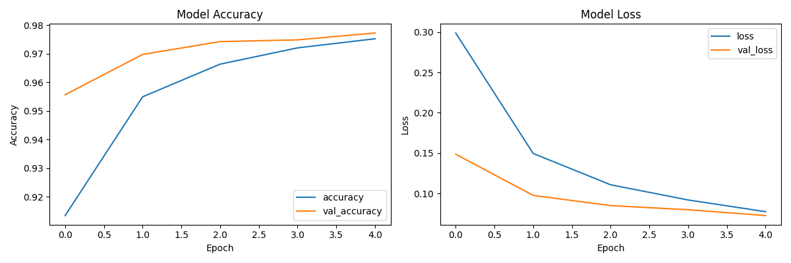
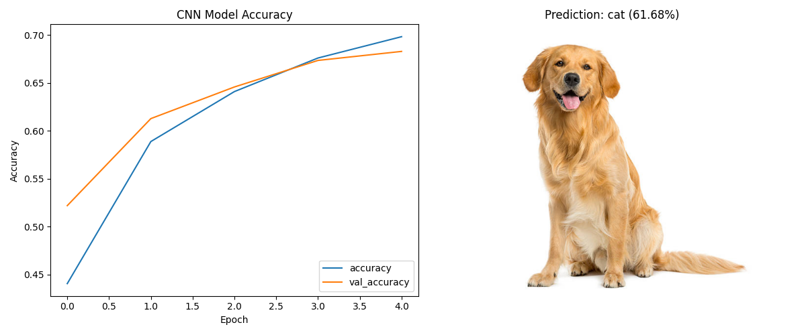

# OpenCV Image Recognition 실습 과제 (0402)

---

## 과제 1: 간단한 이미지 분류기 구현 (`0402-1.py`)

### 1. 문제 정의
*   `MNIST` 데이터셋을 활용하여 손글씨 숫자(0~9)를 분류하는 간단한 이미지 분류기를 구현합니다.
*   다층 퍼셉트론(MLP 구조: `Dense` 레이어 사용) 모델을 설계하고, 모델 훈련 결과를 시각화하여 확인합니다.

### 2. 전체 코드 (0402-1.py)
```python
import tensorflow as tf
from tensorflow.keras import layers, models
import matplotlib.pyplot as plt
import os
import numpy as np

# 경로 설정
base_dir = os.path.dirname(os.path.abspath(__file__))

# 1. MNIST 데이터셋 로드
mnist = tf.keras.datasets.mnist
(x_train, y_train), (x_test, y_test) = mnist.load_data()

# 데이터 전처리 (정규화)
x_train, x_test = x_train / 255.0, x_test / 255.0

# 2. 간단한 신경망 모델 구축
model = models.Sequential([
    layers.Flatten(input_shape=(28, 28)),
    layers.Dense(128, activation='relu'),
    layers.Dropout(0.2),
    layers.Dense(10, activation='softmax')
])

# 모델 컴파일
model.compile(optimizer='adam',
              loss='sparse_categorical_crossentropy',
              metrics=['accuracy'])

# 3. 모델 훈련
print("---- 모델 훈련 시작 ----")
history = model.fit(x_train, y_train, epochs=5, validation_data=(x_test, y_test))
print("---- 모델 훈련 완료 ----")

# 4. 모델 평가 및 결과 시각화
test_loss, test_acc = model.evaluate(x_test,  y_test, verbose=2)
print(f"Test accuracy: {test_acc}")

# 결과 출력 (훈련 정확도 및 손실 그래프)
plt.figure(figsize=(12, 4))
plt.subplot(1, 2, 1)
plt.plot(history.history['accuracy'], label='accuracy')
plt.plot(history.history['val_accuracy'], label='val_accuracy')
plt.xlabel('Epoch')
plt.ylabel('Accuracy')
plt.legend(loc='lower right')
plt.title('Model Accuracy')

plt.subplot(1, 2, 2)
plt.plot(history.history['loss'], label='loss')
plt.plot(history.history['val_loss'], label='val_loss')
plt.xlabel('Epoch')
plt.ylabel('Loss')
plt.legend(loc='upper right')
plt.title('Model Loss')

plt.tight_layout()
plt.savefig(os.path.join(base_dir, '0402-1.png'))
# plt.show()
```

### 3. 요구사항 별 핵심 코드 설명
*   **데이터셋 로드 및 전처리 (Normalization):**
    ```python
    mnist = tf.keras.datasets.mnist
    (x_train, y_train), (x_test, y_test) = mnist.load_data()
    x_train, x_test = x_train / 255.0, x_test / 255.0
    ```
    > **원리:** 흑백 이미지인 MNIST는 각 픽셀이 0~255 사이의 정수값을 가집니다. 이를 `255.0`으로 나누어 0.0~1.0 사이의 실수 값으로 스케일링(정규화)합니다.
    > **이유:** 값의 범위를 작게 만들면 경사 하강법(Gradient Descent) 모델이 학습할 때 가중치(Weight) 업데이트가 더 빠르고 안정적으로 이루어지기 때문입니다. 즉, 정확도와 수렴 속도를 높이기 위한 필수 과정입니다.

*   **신경망 모델 구축 (MLP 구조):**
    ```python
    model = models.Sequential([
        layers.Flatten(input_shape=(28, 28)),
        layers.Dense(128, activation='relu'),
        layers.Dropout(0.2), # 추가로 사용된 계층 (과적합 방지)
        layers.Dense(10, activation='softmax')
    ])
    ```
    > 여기서 `Sequential`은 각 층을 순차적으로 쌓는 모델임을 의미합니다.
    > 1. **`Flatten`**: 28x28 크기의 2차원 이미지를 1차원 배열(길이 784)로 쭉 펴줍니다(평탄화). 모델의 입력층 역할을 합니다.
    > 2. **`Dense(128, activation='relu')`**: 128개의 노드를 가진 은닉층(Hidden Layer)입니다. 모든 픽셀의 입력과 촘촘히 연결되는 완전 연결 계층(Fully-Connected Layer)이며, `relu` 함수는 음수 값을 0으로 차단하여 모델이 직선뿐 아니라 복잡한 패턴(비선형성)도 학습할 수 있게 해줍니다.
    > 3. **`Dropout(0.2)`**: 학습 과정에서 랜덤하게 20%의 노드를 끄고 학습합니다. 특정 데이터나 특정 노드에 과도하게 치우쳐서 훈련 데이터를 외워버리는 현상(과적합, Overfitting)을 방지합니다.
    > 4. **`Dense(10, activation='softmax')`**: 숫자가 0부터 9까지 10개 클래스이므로, 출력층의 노드는 10개로 설정합니다. `softmax`는 10개 노드의 출력값 총합이 딱 1.0(100%)이 되도록 변환해 주어, 최종 결과를 '확률'처럼 직관적으로 해석할 수 있게 만듭니다.

### 4. 결과 사진


---

## 과제 2: CIFAR-10 데이터셋을 활용한 CNN 모델 구축 (`0402-2.py`)

### 1. 문제 정의
*   `CIFAR-10` 데이터셋(10개 클래스의 32x32 컬러 이미지)을 활용하여 이미지 분류를 수행하는 합성곱 신경망(CNN)을 구축합니다.
*   학습된 모델을 저장하거나, 테스트 이미지(`dog.jpg`)를 직접 모델에 입력하여 모델이 예상하는 예측값과 확률을 시각적으로 확인합니다.

### 2. 전체 코드 (0402-2.py)
```python
import tensorflow as tf
from tensorflow.keras import layers, models
import matplotlib.pyplot as plt
import os
import cv2
import numpy as np

# 경로 설정
base_dir = os.path.dirname(os.path.abspath(__file__))
img_path = os.path.join(base_dir, 'dog.jpg')

# 1. CIFAR-10 데이터셋 로드
cifar10 = tf.keras.datasets.cifar10
(x_train, y_train), (x_test, y_test) = cifar10.load_data()

# 데이터 전처리 (정규화)
x_train, x_test = x_train / 255.0, x_test / 255.0

class_names = ['airplane', 'automobile', 'bird', 'cat', 'deer',
               'dog', 'frog', 'horse', 'ship', 'truck']

# 2. CNN 모델 구축 (개선된 모델)
model = models.Sequential([
    layers.Conv2D(32, (3, 3), padding='same', activation='relu', input_shape=(32, 32, 3)),
    layers.BatchNormalization(),
    layers.Conv2D(32, (3, 3), padding='same', activation='relu'),
    layers.BatchNormalization(),
    layers.MaxPooling2D((2, 2)),
    layers.Dropout(0.25),

    layers.Conv2D(64, (3, 3), padding='same', activation='relu'),
    layers.BatchNormalization(),
    layers.Conv2D(64, (3, 3), padding='same', activation='relu'),
    layers.BatchNormalization(),
    layers.MaxPooling2D((2, 2)),
    layers.Dropout(0.25),

    layers.Flatten(),
    layers.Dense(128, activation='relu'),
    layers.BatchNormalization(),
    layers.Dropout(0.5),
    layers.Dense(10, activation='softmax')
])

# 모델 컴파일
model.compile(optimizer='adam',
              loss='sparse_categorical_crossentropy',
              metrics=['accuracy'])

# 3. 모델 훈련
print("---- CNN 모델 훈련 시작 ----")
history = model.fit(x_train, y_train, epochs=15, batch_size=64, validation_data=(x_test, y_test))
print("---- CNN 모델 훈련 완료 ----")

# 4. 모델 평가 및 dog.jpg 예측 (Prediction)
test_loss, test_acc = model.evaluate(x_test,  y_test, verbose=2)
print(f"Test accuracy: {test_acc}")

# 테스트 이미지 로드 및 전처리
test_img = cv2.imread(img_path)
test_img_rgb = cv2.cvtColor(test_img, cv2.COLOR_BGR2RGB)
test_img_resized = cv2.resize(test_img_rgb, (32, 32))
input_img = np.expand_dims(test_img_resized, axis=0) / 255.0

# 5. 예측 결과 추론
predictions = model.predict(input_img)
predicted_class = class_names[np.argmax(predictions)]
predicted_prob = np.max(predictions)

# 결과 출력 (훈련 정확도 및 예측 이미지)
plt.figure(figsize=(12, 5))
plt.subplot(1, 2, 1)
plt.plot(history.history['accuracy'], label='accuracy')
plt.plot(history.history['val_accuracy'], label='val_accuracy')
plt.xlabel('Epoch')
plt.ylabel('Accuracy')
plt.legend(loc='lower right')
plt.title('CNN Model Accuracy')

plt.subplot(1, 2, 2)
plt.imshow(test_img_rgb)
plt.title(f"Prediction: {predicted_class} ({predicted_prob*100:.2f}%)")
plt.axis('off')

plt.tight_layout()
plt.savefig(os.path.join(base_dir, '0402-2.png'))
# plt.show()
```

### 3. 요구사항 별 핵심 코드 설명
*   **합성곱 신경망(CNN) 층 구성:**
    ```python
    model = models.Sequential([
        layers.Conv2D(32, (3, 3), padding='same', activation='relu', input_shape=(32, 32, 3)),
        layers.BatchNormalization(),
        layers.MaxPooling2D((2, 2)),
        layers.Dropout(0.25),
        ...
        layers.Flatten(),
        layers.Dense(128, activation='relu'),
        layers.BatchNormalization(),
        layers.Dropout(0.5),
        layers.Dense(10, activation='softmax')
    ])
    ```
    > 일반 다층 퍼셉트론(MLP)과 달리, 이미지의 픽셀 간 2차원 공간 정보를 살리는 **CNN 아키텍처**를 적용했습니다.
    > 1. **`Conv2D`**: (3, 3) 크기의 필터 창이 이미지를 조금씩 훑으며 선, 모서리 등 공간적인 핵심 특징(Feature)을 도장 찍듯 추출합니다. `padding='same'`을 부여하면 계산할 때 이미지 외곽에 0을 덧대어 출력 이미지 사이즈가 줄어들지 않도록 유지해 줍니다.
    > 2. **`BatchNormalization`**: 각 계층을 통과할 때마다 데이터의 분포값이 요동치는 것을 막기 위해 평균과 분산을 재조정합니다. 학습 속도를 크게 높이고 높은 안정성을 제공합니다.
    > 3. **`MaxPooling2D`**: (2, 2) 크기의 영역 안에서 가장 수치가 강한 픽셀값 하나만 뽑아내어 이미지의 해상도를 절반으로 축소합니다. 불필요한 공간 정보와 연산량을 줄이고 중요한 특성만 요약해 남기는 압축(풀링) 작업입니다.
    > 4. **`Flatten` & `Dense`**: CNN 층들의 연쇄 작업 결과물로 나온 압축된 2차원 특징 맵들을 `Flatten`으로 길게 한 줄로 펴준 뒤(1차원), 일반적인 `Dense` 계층을 통과시켜 서로 엮은 다음 10개 카테고리에 대한 최종 추측 확률(`softmax`)을 환산해냅니다.

*   **테스트 이미지 예측 처리 (커스텀 데이터 추론):**
    ```python
    test_img_resized = cv2.resize(test_img_rgb, (32, 32))
    input_img = np.expand_dims(test_img_resized, axis=0) / 255.0
    predictions = model.predict(input_img)
    ```
    > 만들어진 모델이 실제로 새로운 사진 파일(`dog.jpg`)을 어떻게 예측하는지 시도하는 과정입니다. 이를 위해서는 모델이 훈련할 때 먹었던 데이터와 입력 형식을 완전히 똑같이 맞춰주어야 합니다.
    > 1. **`cv2.resize(..., (32, 32))`**: 원본 사진(`dog.jpg`)의 사이즈가 제각각이므로, 모델이 학습했던 규격인 32x32 정사각형 크기로 강제 축소/변환합니다.
    > 2. **`np.expand_dims(..., axis=0)`**: 케라스(Keras) 모델은 하나를 예측할 때도 (데이터 개수=배치 단위, 세로, 가로, 색상채널) 형태의 4차원 데이터 구조를 기대합니다. 테스트 사진은 1장이므로 `[32, 32, 3]` 형태를 껍질 하나 더 씌워 `[1, 32, 32, 3]` 형태로 차원을 추가 확장해 줍니다.
    > 3. **`/ 255.0`**: 픽셀값이 0~255인 상태이므로, 학습할 때처럼 스케일링(정규화)하여 0~1 사이로 값을 나눕니다.
    > 4. **`model.predict`**: 모델에 사진을 집어넣으면 [비행기, 자동차, 새... 고양이, 개, 개구리...] 10가지 값에 대응하는 각 확률 퍼센티지가 담긴 넘파이 배열이 나옵니다. 여기서 `np.argmax(predictions)`를 사용하여 가장 확률이 높은 항목의 인덱스를 찾아내어 최종 결론으로 도출합니다.

### 4. 결과 사진

