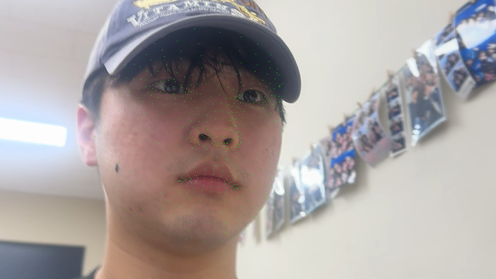

# OpenCV Dynamic Vision 실습 과제 (0409)

---

## 과제 1: SORT 알고리즘을 활용한 다중 객체 추적기 구현 (`0409-1.py`)

### 1. 문제 정의
*   `YOLOv3` 모델과 `cv2.dnn`을 사용하여 비디오(`slow_traffic_small.mp4`) 내의 동적 객체(자동차, 트럭 등)를 검출합니다.
*   **SORT(Simple Online and Realtime Tracking)** 알고리즘(칼만 필터 + 헝가리안 알고리즘)을 이용하여 각각 검출된 객체에 고유 추적 ID를 부여하고 실시간으로 시각화합니다.

### 2. 전체 코드 (`0409-1.py`)
```python
import cv2
import numpy as np
import os
import sys

# sort.py에서 클래스 가져오기
from sort import Sort

def main():
    base_dir = os.path.dirname(os.path.abspath(__file__))
    model_weights = os.path.join(base_dir, "L06", "yolov3.weights")
    model_cfg = os.path.join(base_dir, "L06", "yolov3.cfg")
    video_path = os.path.join(base_dir, "L06", "slow_traffic_small.mp4")

    # YOLO 모델 로드
    net = cv2.dnn.readNet(model_weights, model_cfg)
    layer_names = net.getLayerNames()
    try:
        output_layers_indices = net.getUnconnectedOutLayers()
        output_layers = [layer_names[i - 1] for i in output_layers_indices.flatten()]
    except:
        output_layers = net.getUnconnectedOutLayersNames()

    cap = cv2.VideoCapture(video_path)
    if not cap.isOpened():
        print("비디오를 열 수 없습니다.")
        sys.exit()

    # SORT 추적기 초기화
    tracker = Sort()
    frame_idx = 0

    print("YOLO + SORT 비디오 추적을 시작합니다. (종료하려면 ESC)")

    while True:
        ret, frame = cap.read()
        if not ret:
            break
        
        frame_idx += 1
        height, width, channels = frame.shape
        
        # YOLO 이미지 전처리 및 추론
        blob = cv2.dnn.blobFromImage(frame, 0.00392, (416, 416), (0, 0, 0), True, crop=False)
        net.setInput(blob)
        outs = net.forward(output_layers)
        
        class_ids = []
        confidences = []
        boxes = []
        
        for out in outs:
            for detection in out:
                scores = detection[5:]
                class_id = np.argmax(scores)
                confidence = scores[class_id]
                
                if confidence > 0.5:
                    center_x = int(detection[0] * width)
                    center_y = int(detection[1] * height)
                    w = int(detection[2] * width)
                    h = int(detection[3] * height)
                    
                    x = int(center_x - w / 2)
                    y = int(center_y - h / 2)
                    
                    boxes.append([x, y, w, h])
                    confidences.append(float(confidence))
                    class_ids.append(class_id)
        
        indexes = cv2.dnn.NMSBoxes(boxes, confidences, 0.5, 0.4)
        
        # SORT 입력을 위한 Detection 포맷 (Numpy array)
        dets = []
        if len(indexes) > 0:
            for i in indexes.flatten():
                x, y, w, h = boxes[i]
                dets.append([x, y, x + w, y + h, confidences[i]])
        
        dets = np.array(dets)
        if len(dets) == 0:
            dets = np.empty((0, 5))
            
        # SORT 업데이트 및 Track ID 할당
        trackers = tracker.update(dets)
        
        for d in trackers:
            dx1, dy1, dx2, dy2, track_id = map(int, d)
            cv2.rectangle(frame, (dx1, dy1), (dx2, dy2), (0, 255, 0), 2)
            cv2.putText(frame, f"ID: {track_id}", (dx1, dy1 - 10), cv2.FONT_HERSHEY_SIMPLEX, 0.6, (0, 255, 0), 2)
            
        cv2.imshow("Multi-Object Tracking (SORT)", frame)
        
        # 지정된 위치에서 자동 스크린샷 캡쳐 (0409-1.png)
        if frame_idx == 50:
            cv2.imwrite(os.path.join(base_dir, "0409-1.png"), frame)
            
        if cv2.waitKey(1) == 27: # ESC
            break
            
    cap.release()
    cv2.destroyAllWindows()

if __name__ == '__main__':
    main()
```

### 3. 과제 설명 및 주요 코드 분석
*   **객체 검출(YOLOv3):** `cv2.dnn.readNet`을 활용하여 YOLO 가중치와 구성 파일을 맵핑합니다. 임계치 `0.5` 이상의 Confidence를 보이는 객체 영역을 찾아내며, NMSBox로 겹치는 바운딩 박스를 최소화하여 가장 적합한 테두리를 `[x, y, w, h]` 형태로 얻어냅니다.
*   **SORT 추적기(`tracker = Sort()`):** 앞서 검출된 N개의 바운딩 박스를 `[x1, y1, x2, y2, confidence]`의 numpy 배열 형태로 변환 후 전달합니다. 그러면 내부의 *상태 예측 모델(칼만 필터)*과 *데이터 매칭 방법론(헝가리안 매칭)*을 통해, 동일한 차량 객체가 다른 사람이나 프레임 끊김에 상관없이 같은 고유한 번호(ID)를 이어 나갈 수 있도록 보장해 줍니다!


### 4. 결과 영상
<video src="https://github.com/yvns2nvg/Opencv/raw/main/0409/0409-1_output.mp4" controls="controls" width="100%"></video>

*(위 영상 링크가 브라우저 환경에 따라 바로 재생되지 않을 경우, **[👉 여기를 클릭하여 결과 영상 보기](https://github.com/yvns2nvg/Opencv/blob/main/0409/0409-1_output.mp4)**)*

---

## 과제 2: Mediapipe를 활용한 얼굴 랜드마크 추출 및 시각화 (`0409-2.py`)

### 1. 문제 정의
*   `Mediapipe FaceMesh` 모듈과 내장 웹캠을 연동하여, 얼굴의 468개 랜드마크(특징점) 좌표를 얻고 이를 카메라 실시간 영상 뷰에 시각적으로 뿌려주는 프로그램을 작성합니다.

### 2. 전체 코드 (`0409-2.py`)
```python
import cv2
import mediapipe as mp
import os

def main():
    base_dir = os.path.dirname(os.path.abspath(__file__))
    
    # MediaPipe FaceMesh 추적 객체 선언
    mp_face_mesh = mp.solutions.face_mesh
    face_mesh = mp_face_mesh.FaceMesh(
        max_num_faces=1, 
        refine_landmarks=True, 
        min_detection_confidence=0.5, 
        min_tracking_confidence=0.5
    )
    
    cap = cv2.VideoCapture(0)
    
    if not cap.isOpened():
        print("웹캠을 열 수 없습니다.")
        return

    frame_idx = 0
    saved = False

    print("MediaPipe FaceMesh 실시간 인식을 시작합니다. (종료하려면 ESC)")

    while True:
        ret, frame = cap.read()
        if not ret:
            break

        # 모델이 요구하는 RGB로 색 영역 치환
        rgb_frame = cv2.cvtColor(frame, cv2.COLOR_BGR2RGB)
        results = face_mesh.process(rgb_frame)

        if results.multi_face_landmarks:
            frame_idx += 1
            for face_landmarks in results.multi_face_landmarks:
                h, w, c = frame.shape
                # 각 랜드마크 포인트(468개)를 반복문 안에서 추출
                for landmark in face_landmarks.landmark:
                    # 결과 좌표는 0.0~1.0 비율 구조 이므로 절대 너비, 높이를 곱해주어야 함
                    x = int(landmark.x * w)
                    y = int(landmark.y * h)
                    cv2.circle(frame, (x, y), 1, (0, 255, 0), -1)

            # 성공적으로 렌더링된 결과를 이미지로 자동 저장 처리
            if frame_idx == 30 and not saved:
                save_path = os.path.join(base_dir, "0409-2.png")
                cv2.imwrite(save_path, frame)
                saved = True

        cv2.imshow('MediaPipe FaceMesh (468 Landmarks)', frame)

        if cv2.waitKey(1) == 27: # ESC
            break

    cap.release()
    cv2.destroyAllWindows()

if __name__ == '__main__':
    main()
```

### 3. 과제 설명 및 주요 코드 분석
*   **초기화 기법:** `mp_face_mesh.FaceMesh`를 활용하여 모듈을 적재합니다. 인식 신뢰도(`min_detection_confidence`)를 `0.5`로 설정하여 기준을 유연하게 잡고, 추적이 흔들리지 않도록 `min_tracking_confidence`를 추가했습니다. `max_num_faces=1`을 지정하여 메인 얼굴 1개만 추적합니다.
*   **랜드마크 렌더링 스텝:** 얼굴이 정상 탐지되었을 경우 `results.multi_face_landmarks` 객체에 데이터가 포진됩니다. 각각의 요소 `landmark`가 가지고 있는 x, y 정보는 `0.0 ~ 1.0` 사이의 비율 정규화 수치이므로, 이를 원본 프레임의 `width` 및 `height`와 곱해주어 실제 픽셀 좌표 스케일로 바꾼 후 화면(frame) 안에 원 모양(`cv2.circle`)으로 타점합니다.

### 4. 결과 사진

