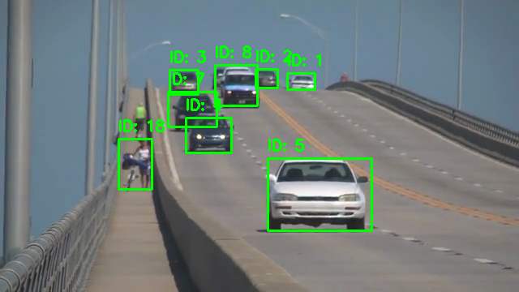

# OpenCV Dynamic Vision 실습 과제 (0409)

---

## 과제 1: SORT 알고리즘을 활용한 다중 객체 추적기 구현 (`0409-1.py`)

### 1. 문제 정의
*   `YOLOv3` 모델과 `cv2.dnn`을 사용하여 비디오(`slow_traffic_small.mp4`) 내의 동적 객체(자동차, 트럭 등)를 검출합니다.
*   **SORT(Simple Online and Realtime Tracking)** 알고리즘(칼만 필터 + 헝가리안 알고리즘)을 이용하여 각각 검출된 객체에 고유 추적 ID를 부여하고 실시간으로 시각화합니다.

### 2. 전체 코드 (`0409-1.py`)
```python
import cv2
import numpy as np
import os
import sys

# sort.py에서 클래스 가져오기
from sort import Sort

def main():
    base_dir = os.path.dirname(os.path.abspath(__file__))
    model_weights = os.path.join(base_dir, "L06", "yolov3.weights")
    model_cfg = os.path.join(base_dir, "L06", "yolov3.cfg")
    video_path = os.path.join(base_dir, "L06", "slow_traffic_small.mp4")

    # YOLO 모델 로드
    net = cv2.dnn.readNet(model_weights, model_cfg)
    layer_names = net.getLayerNames()
    try:
        output_layers_indices = net.getUnconnectedOutLayers()
        output_layers = [layer_names[i - 1] for i in output_layers_indices.flatten()]
    except:
        output_layers = net.getUnconnectedOutLayersNames()

    cap = cv2.VideoCapture(video_path)
    if not cap.isOpened():
        print("비디오를 열 수 없습니다.")
        sys.exit()

    # SORT 추적기 초기화
    tracker = Sort()
    frame_idx = 0

    print("YOLO + SORT 비디오 추적을 시작합니다. (종료하려면 ESC)")

    while True:
        ret, frame = cap.read()
        if not ret:
            break
        
        frame_idx += 1
        height, width, channels = frame.shape
        
        # YOLO 이미지 전처리 및 추론
        blob = cv2.dnn.blobFromImage(frame, 0.00392, (416, 416), (0, 0, 0), True, crop=False)
        net.setInput(blob)
        outs = net.forward(output_layers)
        
        class_ids = []
        confidences = []
        boxes = []
        
        for out in outs:
            for detection in out:
                scores = detection[5:]
                class_id = np.argmax(scores)
                confidence = scores[class_id]
                
                if confidence > 0.5:
                    center_x = int(detection[0] * width)
                    center_y = int(detection[1] * height)
                    w = int(detection[2] * width)
                    h = int(detection[3] * height)
                    
                    x = int(center_x - w / 2)
                    y = int(center_y - h / 2)
                    
                    boxes.append([x, y, w, h])
                    confidences.append(float(confidence))
                    class_ids.append(class_id)
        
        indexes = cv2.dnn.NMSBoxes(boxes, confidences, 0.5, 0.4)
        
        # SORT 입력을 위한 Detection 포맷 (Numpy array)
        dets = []
        if len(indexes) > 0:
            for i in indexes.flatten():
                x, y, w, h = boxes[i]
                dets.append([x, y, x + w, y + h, confidences[i]])
        
        dets = np.array(dets)
        if len(dets) == 0:
            dets = np.empty((0, 5))
            
        # SORT 업데이트 및 Track ID 할당
        trackers = tracker.update(dets)
        
        for d in trackers:
            dx1, dy1, dx2, dy2, track_id = map(int, d)
            cv2.rectangle(frame, (dx1, dy1), (dx2, dy2), (0, 255, 0), 2)
            cv2.putText(frame, f"ID: {track_id}", (dx1, dy1 - 10), cv2.FONT_HERSHEY_SIMPLEX, 0.6, (0, 255, 0), 2)
            
        cv2.imshow("Multi-Object Tracking (SORT)", frame)
        
        # 지정된 위치에서 자동 스크린샷 캡쳐 (0409-1.png)
        if frame_idx == 50:
            cv2.imwrite(os.path.join(base_dir, "0409-1.png"), frame)
            
        if cv2.waitKey(1) == 27: # ESC
            break
            
    cap.release()
    cv2.destroyAllWindows()

if __name__ == '__main__':
    main()
```

### 3. 과제 설명 및 주요 코드 분석
*   **YOLOv3 모델 로드 및 전처리:**
    *   `cv2.dnn.readNet`을 통해 YOLO 가중치 파일(`.weights`)과 환경 설정 파일(`.cfg`)을 불러옵니다.
    *   `cv2.dnn.blobFromImage`를 사용하여 프레임을 YOLO 모델의 입력 형식에 맞게 1/255(0.00392) 스케일링, 416x416 크기 변경, BGR to RGB 변환 처리를 진행합니다. 
*   **객체 검출 리스트 필터링 (NMS 적용):**
    *   YOLO 추론의 결과값(`outs`)을 순회하면서 객체일 확률(Confidence)이 0.5 이상인 박스들만 1차적으로 수집합니다.
    *   이때 검출된 중심 좌표와 너비, 높이 데이터(`center_x, center_y, w, h`)를 화면의 스케일에 맞게 복원하고, 시각화를 위해 좌측 상단 기준 좌표(`x, y`)로 재구성합니다.
    *   `cv2.dnn.NMSBoxes` (Non-Maximum Suppression) 알고리즘을 적용해 한 객체에 중복해서 잡힌 여러 개의 바운딩 박스 중 가장 정확한 하나만 남기고 나머지를 제거합니다.
*   **SORT 추적기를 활용한 다중 객체 트래킹(`tracker.update`):**
    *   SORT 알고리즘은 칼만 필터(상태 예측)와 헝가리안 알고리즘(데이터 매칭)을 결합한 매우 빠르고 실용적인 객체 추적 프레임워크입니다.
    *   YOLO를 거친 객체 바운딩 박스 정보들을 형식에 맞춰 넘파이 배열 `[x1, y1, x2, y2, score]` 형태로 묶어 `tracker.update(dets)` 의 입력으로 전달합니다.
    *   SORT는 이전 프레임의 객체와 현재 프레임의 바운딩 박스를 매칭시켜, 단순히 객체를 인식하는 것에 그치지 않고 **비디오 내에서 차량이 이동하더라도 동일한 차량 객체에게 똑같은 고유 인식 번호(Track ID)를 일관되게 부여**해줍니다.


### 4. 결과 사진


---

## 과제 2: Mediapipe를 활용한 얼굴 랜드마크 추출 및 시각화 (`0409-2.py`)

### 1. 문제 정의
*   `Mediapipe FaceMesh` 모듈과 내장 웹캠을 연동하여, 얼굴의 468개 랜드마크(특징점) 좌표를 얻고 이를 카메라 실시간 영상 뷰에 시각적으로 뿌려주는 프로그램을 작성합니다.

### 2. 전체 코드 (`0409-2.py`)
```python
import cv2
import mediapipe as mp
import os

def main():
    base_dir = os.path.dirname(os.path.abspath(__file__))
    
    # MediaPipe FaceMesh 추적 객체 선언
    mp_face_mesh = mp.solutions.face_mesh
    face_mesh = mp_face_mesh.FaceMesh(
        max_num_faces=1, 
        refine_landmarks=True, 
        min_detection_confidence=0.5, 
        min_tracking_confidence=0.5
    )
    
    cap = cv2.VideoCapture(0)
    
    if not cap.isOpened():
        print("웹캠을 열 수 없습니다.")
        return

    frame_idx = 0
    saved = False

    print("MediaPipe FaceMesh 실시간 인식을 시작합니다. (종료하려면 ESC)")

    while True:
        ret, frame = cap.read()
        if not ret:
            break

        # 모델이 요구하는 RGB로 색 영역 치환
        rgb_frame = cv2.cvtColor(frame, cv2.COLOR_BGR2RGB)
        results = face_mesh.process(rgb_frame)

        if results.multi_face_landmarks:
            frame_idx += 1
            for face_landmarks in results.multi_face_landmarks:
                h, w, c = frame.shape
                # 각 랜드마크 포인트(468개)를 반복문 안에서 추출
                for landmark in face_landmarks.landmark:
                    # 결과 좌표는 0.0~1.0 비율 구조 이므로 절대 너비, 높이를 곱해주어야 함
                    x = int(landmark.x * w)
                    y = int(landmark.y * h)
                    cv2.circle(frame, (x, y), 1, (0, 255, 0), -1)

            # 성공적으로 렌더링된 결과를 이미지로 자동 저장 처리
            if frame_idx == 30 and not saved:
                save_path = os.path.join(base_dir, "0409-2.png")
                cv2.imwrite(save_path, frame)
                saved = True

        cv2.imshow('MediaPipe FaceMesh (468 Landmarks)', frame)

        if cv2.waitKey(1) == 27: # ESC
            break

    cap.release()
    cv2.destroyAllWindows()

if __name__ == '__main__':
    main()
```

### 3. 과제 설명 및 주요 코드 분석
*   **MediaPipe Face Mesh 초기화 (`mp.solutions.face_mesh`):**
    *   `mp.solutions.face_mesh.FaceMesh`를 활용하여 468개의 얼굴 3D 특징점(랜드마크)을 매우 빠르고 정밀하게 추적할 수 있는 객체를 생성합니다.
    *   `max_num_faces=1`: 비디오에서 탐지할 최대 얼굴 개수를 1개로 제한합니다.
    *   `refine_landmarks=True`: 눈과 입술 주변의 랜드마크를 추가로 세밀하게 검출하여 정확도를 높입니다.
    *   `min_detection_confidence=0.5` & `min_tracking_confidence=0.5`: 객체 인식률과 추적에 대한 최소 신뢰도를 유연하게 0.5로 설정하여 얼굴을 놓치지 않고 연속적으로 부드럽게 추적하도록 돕습니다.
*   **색상 체계 변환 (BGR → RGB):**
    *   OpenCV는 이미지를 기본적으로 `BGR` 색상 구조로 읽어 들입니다. 하지만 MediaPipe는 `RGB` 기반으로 학습되었기 때문에 `cv2.cvtColor(frame, cv2.COLOR_BGR2RGB)`를 통해 이미지를 RGB로 먼저 치환해야 올바른 형태의 추론을 수행할 수 있습니다.
*   **정규화된 랜드마크의 복원 및 시각화 스텝:**
    *   탐지가 성공하면 `results.multi_face_landmarks` 객체 내에 각 특징점의 데이터가 담기게 됩니다.
    *   이 데이터(`landmark.x`, `landmark.y`)는 원본 해상도와 무관하게 `0.0 ~ 1.0` 사이의 정규화된 비율 정보를 가지고 있습니다.
    *   따라서 이를 화면에 점으로 찍어 시각화하려면 `x = int(landmark.x * width)`, `y = int(landmark.y * height)` 와 같이 원본 프레임의 너비와 높이를 각각 곱해 실제 화면상 픽셀 좌표로 환산해 주어야 합니다. 변환된 좌표에 `cv2.circle` 함수를 사용해 화면 상에 실시간으로 드로잉을 진행합니다.

### 4. 결과 사진

